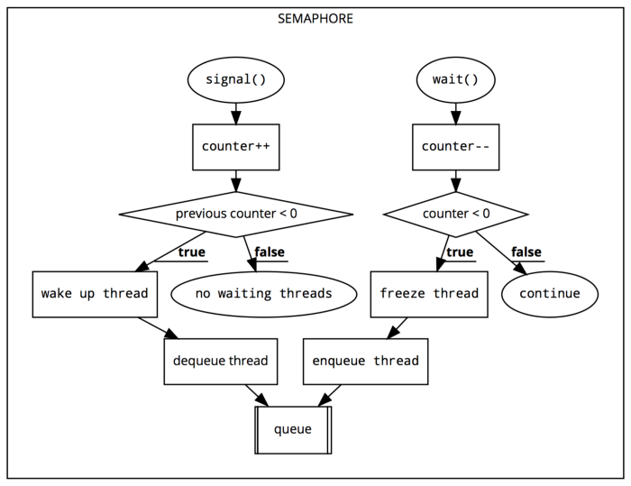

# What is concurrency?
- Wikipedia defines concurrency as "the decomposability property of a program, algorithm, or problem into order-independent or partially-ordered components or units." What this means is looking at the logic of your app to determine which pieces can run at the same time, and possibly in a random order, yet still result in a correct implementation of your data flow.

# GCD & Operations
- There are two APIs that you'll use when making your app concurrent: Grand Central Dispatch, commonly referred to as GCD, and Operations. These are neither competing technologies nor something that you have to exclusively pick between. In fact, Operations are built on top of GCD!

- **Thread-safe** : code that can be safely called from multiple threads without causing any issues.

## Grand Central Dispatch

- GCD is Apple's implementation of C's libdispatch library. Its purpose is to queue up tasks — either a method or a closure — that can be run in parallel, depending on availability of resources; it then executes the tasks on an available processor core.

>Note: Apple's documentation sometimes refers to a block in lieu of closure, since
>that was the name used in Objective-C. You can consider them interchangeable in
>the context of concurrency.

- While GCD uses threads in its implementation, you, as the developer, do not need to worry about managing them yourself. GCD's tasks are so lightweight to enqueue that Apple, in its 2009 technical brief on GCD, stated that only 15 instructions are required for implementation, whereas creating traditional threads could require several hundred instructions.

- All of the tasks that GCD manages for you are placed into GCD-managed first-in, firstout (FIFO) queues. Each task that you submit to a queue is then executed against a pool of threads fully managed by the system.

> Note: There is no guarantee as to which thread your task will execute against

# Synchronous and asynchronous tasks

- Work placed into the queue may either run synchronously or asynchronously. When running a task synchronously, your app will wait and block the current run loop until execution finishes before moving on to the next task. Alternatively, a task that is run asynchronously will start, but return execution to your app immediately. This way, the app is free to run other tasks while the first one is executing.

>Note: It's important to keep in mind that, while the queues are FIFO based, that does not ensure that tasks will finish in the order you submit them. The FIFO procedure applies to when the task starts, not when it finishes.

- In general, you'll want to take any long-running non-UI task that you can find and make it run asynchronously in the background. GCD makes this very simple via closures with a few lines of code, like so:
```swift
// Class level variable
let queue = DispatchQueue(label: "com.raywenderlich.worker")
// Somewhere in your function
queue.async {
// Call slow non-UI methods here
    DispatchQueue.main.async {
    // Update the UI here
    }
}
```
- you create a queue, submit a task to it to run asynchronously on a background thread, and, when it's complete, you delegate the code back to the main thread to update the UI.

## Serial and concurrent queues

- The queue to which your task is submitted also has a characteristic of being either serial or concurrent. Serial queues only have a single thread associated with them and thus only allow a single task to be executed at any given time. A concurrent queue, on the other hand, is able to utilize as many threads as the system has resources for. Threads will be created and released as necessary on a concurrent queue.

> Note: While you can tell iOS that you'd like to use a concurrent queue, remember that there is no guarantee that more than one task will run at a time. If your iOS device is completely bogged down and your app is competing for resources, it may only be capable of running a single task.

## Asynchronous doesn't mean concurrent

- While the difference seems subtle at first, just because your tasks are asynchronous doesn't mean they will run concurrently. You're actually able to submit asynchronous tasks to either a serial queue or a concurrent queue. Being synchronous or asynchronous simply identifies whether or not the queue on which you're running the task must wait for the task to complete before it can spawn the next task.

- On the other hand, categorizing something as serial versus concurrent identifies whether the queue has a single thread or multiple threads available to it. If you think about it, submitting three asynchronous tasks to a serial queue means that each task has to completely finish before the next task is able to start as there is only one thread available.
- In other words, a task being synchronous or not speaks to the source of the task. Being serial or concurrent speaks to the destination of the task.

# Operations
- GCD is great for common tasks that need to be run a single time in the background. When you find yourself building functionality that should be reusable — such as image editing operations — you will likely want to encapsulate that functionality into a class. By subclassing Operation, you can accomplish that goal!

## Operation subclassing
- Operations are fully-functional classes that can be submitted to an OperationQueue, just like you'd submit a closure of work to a DispatchQueue for GCD. Because they're classes and can contain variables, you gain the ability to know what state the operation is in at any given point.

- Operations can exist in any of the following states:
1-  isReady
2- isExecuting
3- isCancelled
4- isFinished

- Unlike GCD, an operation is run synchronously by default, and getting it to run asynchronously requires more work. While you can directly execute an operation yourself, that's almost never going to be a good idea due to its synchronous nature. You'll want to get it off of the main thread by submitting it to an OperationQueue so that your UI performance isn't impacted.

### Bonus features
- But wait, there's more! Operations provide greater control over your tasks as you can now handle such common needs as cancelling the task, reporting the state of the task, wrapping asynchronous tasks into an operation and specifying dependences between various tasks. Chapter 6, "Operations," will provide a more in-depth discussion of using operations in your app.

### BlockOperation
- Sometimes, you find yourself working on an app that heavily uses operations, but find that you have a need for a simpler, GCD-like, closure. If you don't want to also create a DispatchQueue, then you can instead utilize the BlockOperation class.
- BlockOperation subclasses Operation for you and manages the concurrent execution of one or more closures on the default global queue. However, being an actual Operation subclass lets you take advantage of all the other features of an operation.

> Note: Block operations run concurrently. If you need them to run serially, you'll need to setup a dispatch queue instead.

## Which should you use?
- There's no clear-cut directive as to whether you should use GCD or Operations in your app. GCD tends to be simpler to work with for simple tasks you just need to execute and forget. Operations provide much more functionality when you need to keep track of a job or maintain the ability to cancel it.

- If you're just working with methods or chunks of code that need to be executed, GCD is a fitting choice. If you're working with objects that need to encapsulate data and functionality then you're more likely to utilize Operations. Some developers even go to the extreme of saying that you should always use Operations because it's built on top of GCD, and Apple's guidance says to always use the highest level of abstraction provided

- At the end of the day, you should use whichever technology makes the most sense at the time and provides for the greatest long-term sustainability of your project, or specific use-case.


# Queues & Threads

## Dispatch queues
- The way you work with threads is by creating a DispatchQueue. When you create a queue, the OS will potentially create and assign one or more threads to the queue. If existing threads are available, they can be reused; if not, then the OS will create them as necessary.

- Creating a dispatch queue is pretty simple on your part, as you can see in the example below:
```swift
let label = "com.razeware.mycoolapp.networking"
let queue = DispatchQueue(label: label)
```
- The label argument simply needs to be any unique value for identification purposes. While you could simply use a UUID to guarantee uniqueness, it's best to use a reverse- DNS style name, as shown above (e.g. com.company.app), since the label is what you'll see when debugging and it's helpful to assign it meaningful text.

## The main queue
- When your app starts, a main dispatch queue is automatically created for you. It's a serial queue that's responsible for your UI. Because it's used so often, Apple has made it available as a class variable, which you access via DispatchQueue.main. You never want to execute something synchronously against the main queue, unless it's related to actual UI work. Otherwise, you'll lock up your UI which could potentially degrade your app performance.

- there are two types of dispatch queues: serial or concurrent. The default initializer, as shown in the code above, will create a serial queue wherein each task must complete before the next task is able to start.

- In order to create a concurrent queue, simply pass in the .concurrent attribute, like so:
```swift
let label = "com.razeware.mycoolapp.networking"
let queue = DispatchQueue(label: label, attributes: .concurrent)
```
- Concurrent queues are so common that Apple has provided six different global concurrent queues, depending on the Quality of service (QoS) the queue should have.

### Quality of service

- If you just need a concurrent queue but don't want to manage your own, you can use the global class method on DispatchQueue to get one of the pre-defined global queues:
```swift
let queue = DispatchQueue.global(qos: .userInteractive)
```
### **.userInteractive**
- The .userInteractive QoS is recommended for tasks that the user directly interacts with. UI-updating calculations, animations or anything needed to keep the UI responsive and fast. If the work doesn't happen quickly, things may appear to freeze. Tasks submitted to this queue should complete virtually instantaneously.

### **.userInitiated**
- The .userInitiated queue should be used when the user kicks off a task from the UI that needs to happen immediately, but can be done asynchronously. For example, you may need to open a document or read from a local database. If the user clicked a button, this is probably the queue you want. Tasks performed in this queue should take a few seconds or less to complete.

### **.utility**
- You'll want to use the .utility dispatch queue for tasks that would typically include a progress indicator such as long-running computations, I/O, networking or continuous data feeds. The system tries to balance responsiveness and performance with energy efficiency. Tasks can take a few seconds to a few minutes in this queue.

### **.background**
- For tasks that the user is not directly aware of you should use the .background queue. They don't require user interaction and aren't time sensitive. Prefetching, database maintenance, synchronizing remote servers and performing backups are all great examples. The OS will focus on energy efficiency instead of speed. You'll want to use this queue for work that will take significant time, on the order of minutes or more.

### **.default and .unspecified**
- There are two other possible choices that exist, but you should not use explicitly. There's a .default option, which falls between .userInitiated and .utility and is the default value of the qos argument. It's not intended for you to directly use. The second option is .unspecified, and exists to support legacy APIs that may opt the thread out of a quality of service. It's good to know they exist, but if you're using them, you're almost certainly doing something wrong.

> Note: Global queues are always concurrent and first-in, first-out.

```swift
let queue = DispatchQueue(label: label, qos: .userInitiated, attributes: .concurrent)
```
- If you submit a task with a higher quality of service than the queue has, the queue's level will increase. Not only that, but all the operations enqueued will also have their priority raised as well.

- If the current context is the main thread, the inferred QoS is .userInitiated. You can specify a QoS yourself, but as soon as you'll add a task with a higher QoS, your queue's QoS service will be increased to match it.

> Note: You should never perform UI updates on any queue other than the main
queue. If it's not documented what queue an API callback uses, dispatch it to the
main queue!


> Note: Never call sync from the main thread, since it would block your main thread
and could even potentially cause a deadlock.


## Important Notes

## **serial queue**

- The main queue is a serial queue and it work on 1 thread, so when use `DispatchQueue.main.async` this task will add to the end of queue
```swift
DispatchQueue.main.async {
    print("first async")
}
DispatchQueue.main.async {
    print("second async")
}
print("first")
print("second")

// the result of this example : 

// first
// second
// first async
// second async
```
- you code work on  `DispatchQueue.main.sync` so when you write  `print("first")` and `print("second")`, you add this task to sync in main 
- but when you write  `print("first async")` and `print("second async")` in async then this tasks added to the end of queue

## **concurrent queue**
- Concurrent queue works on multiple threads so when you use `sync` current loop is stoped untile task finish but when you use `async`  the queue perform the work on thread and other work also perfom on other threads 

```swift
DispatchQueue.global().async {
    print("first async")
}
DispatchQueue.global().async {
    print("second async")
}

DispatchQueue.global().sync {
    print("first")
}
DispatchQueue.global().sync {
    print("second")
}

// you can't expect the result becase OS will handle threads
// the these some results that appear to me:

// first
// second async
// first async
// second
-----------------------
// first async
// first
// second async
// second
-----------------------
// first
// first async
// second async
// second
```

# Groups & Semaphores

- The aptly named DispatchGroup class is what you'll use when you want to track the completion of a group of tasks.
- You start by initializing a DispatchGroup. Once you have one and want to track a task as part of that group, you can provide the group as an argument to the async method on any dispatch queue:
```swift
let group = DispatchGroup()
someQueue.async(group: group) { ... your work ... }
someQueue.async(group: group) { ... more work .... }
someOtherQueue.async(group: group) { ... other work ... }
group.notify(queue: DispatchQueue.main) { [weak self] in
    self?.textLabel.text = "All jobs have completed"
}
```
- As seen in the example code above, groups are not hardwired to a single dispatch queue. You can use a single group, yet submit jobs to multiple queues, depending on the priority of the task that needs to be run. DispatchGroups provide a notify(queue:) method, which you can use to be notified as soon as every job submitted has finished.

> Note: The notification is itself asynchronous, so it's possible to submit more jobs
to the group after calling notify, as long as the previously submitted jobs have not
already completed.

```swift
let group = DispatchGroup()

DispatchQueue.main.async(group: group ) {
    print("main_1")
}

DispatchQueue.main.async(group: group ) {
    print("main_2")
}

DispatchQueue.global().async(group: group )  {
    print("global_1")
    sleep(2)
}

DispatchQueue.main.async(group: group ) {
    print("main_3")
}


print("first print")


group.notify(queue: DispatchQueue.main) {
    print("notify")
}

DispatchQueue.global().async(group: group )  {
    print("global_2")
    sleep(2)
}
```
the result is : 

```swift
first print
global_1
global_2
main_1
main_2
main_3
notify

```
- `first print` beacse print method is add to main queue
- beacse global function is concurrent and main queue is serial, so global is work immediatly on more than one thread, and the tasks in main queue it add to the end of queue so these works run in the end 


- You'll notice that the notify method takes a dispatch queue as a parameter. When the jobs are all finished, the closure that you provide will be executed in the indicated dispatch queue. The notify call shown is likely to be the version you'll use most often, but there are a couple other versions which allow you to specify a quality of service as well, for example.

## **Synchronous waiting**

- If, for some reason, you can't respond asynchronously to the group's completion notification, then you can instead use the wait method on the dispatch group. This is a synchronous method that will block the current queue until all the jobs have finished. It takes an optional parameter which specifies how long to wait for the tasks to complete. If not specified then there is an infinite wait time: 

```swift
let group = DispatchGroup()
someQueue.async(group: group) { ... }
someQueue.async(group: group) { ... }
someOtherQueue.async(group: group) { ... }
if group.wait(timeout: .now() + 60) == .timedOut {
    print("The jobs didn't finish in 60 seconds")
}
```
> Note: Remember, this blocks the current thread; never ever call wait on the main queue.

> **It's important to know that the jobs will still run, even after the timeout has happened.**

```swift
let group = DispatchGroup()
let queue = DispatchQueue.global(qos: .userInitiated)
queue.async(group: group) {
print("Start job 1")
Thread.sleep(until: Date().addingTimeInterval(10))
    print("End job 1")
}
queue.async(group: group) {
print("Start job 2")
Thread.sleep(until: Date().addingTimeInterval(2))
    print("End job 2")
}
```
- It then synchronously waits for the group to complete:

```swift
if group.wait(timeout: .now() + 5) == .timedOut {
    print("I got tired of waiting")
} else {
    print("All the jobs have completed")
}
```
- When you run the code You'll immediately see messages telling you that jobs 1 and 2 have started. After two seconds, you'll see a message saying job 2 has completed, and then three seconds later a message saying, "I got tired of waiting."

- You can see from the sample that job 2 only sleeps for two seconds and that's why it can complete. You specified five total seconds of time to wait, and that's not enough for job 1 to complete, so the timeout message was printed.

- However, if you wait another five seconds — you've already waited five and job 1 takes ten seconds — you'll see the completion message for job 1.

- At this point, calling a synchronous wait method like this should be a code smell to you, potentially pointing out other issues in your architecture.

## **Wrapping asynchronous methods**

- A dispatch queue natively knows how to work with dispatch groups, and it takes care of signaling to the system that a job has completed for you. In this case, completed means that the code block has run its course. Why does that matter? Because if you call an asynchronous method inside of your closure, then the closure will complete before the internal asynchronous method has completed.

- You've got to somehow tell the task that it's not done until those internal calls have completed as well. In such a case, you can call the provided enter and leave methods on DispatchGroup. Think of them like a simple count of running tasks. Every time you enter, the count goes up by 1. When you leave, the count goes down by 1:

```swift

queue.dispatch(group: group) {
// count is 1
group.enter()
// count is 2
    someAsyncMethod {
        defer { group.leave() }
        // Perform your work here,
        // count goes back to 1 once complete
    }
}

```
- By calling group.enter(), you let the dispatch group know that there's another block of code running, which should be counted towards the group's overall completion status. You, of course, have to pair that with a corresponding group.leave() call or you'll never be signaled of completion. Because you have to call leave even during error conditions, you will usually want to use a defer statement, as shown above, so that, no matter how you exit the closure, the group.leave() code executes.

- In a simple case similar to the previous code sample, you can simply call the enter / leave pairs directly. If you're going to use someAsyncMethod frequently with dispatch groups, you should wrap the method to ensure you never forget to make the necessary calls:

```swift

func myAsyncAdd(
lhs: Int,
rhs: Int,
completion: @escaping (Int) -> Void) {
// Lots of cool code here
completion(lhs + rhs)
}
func myAsyncAddForGroups(
    group: DispatchGroup,
    lhs: Int,
    rhs: Int,
    completion: @escaping (Int) -> Void) {
    
    group.enter()
    myAsyncAdd(first: first, second: second) { result in
        defer { group.leave() }
        completion(result)
    }
}

```

- The wrapper method takes a parameter for the group that it will count against, and then the rest of the arguments should be exactly the same as that of the method you're wrapping. There's nothing special about wrapping the async method other than being 100% sure that the group enter and leave methods are properly handled.

- If you write a wrapper method, then testing — you do test, right? — is simplified to a single location to validate proper pairing of enter and leave calls in all utilizations.

## **Semaphores**

- There are times when you really need to control how many threads have access to a shared resource. You've already seen the read/write pattern to limit access to a single thread, but there are times when you can allow more resources to be used at once while still maintaining control over the total thread count.

- If you're downloading data from the network, for example, you may wish to limit how many downloads happen at once. You'll use a dispatch queue to offload the work, and you'll use dispatch groups so that you know when all the downloads have completed. However, you only want to allow four downloads to happen at once because you know the data you're getting is quite large and resource-heavy to process.

- By using a DispatchSemaphore, you can handle exactly that use case. Before any desired use of the resource, you simply call the wait method, which is a synchronous function, and your thread will pause execution until the resource is available. If nothing has claimed ownership yet, you immediately get access. If somebody else has it, you'll wait until they signal that they're done with it.

- When creating a semaphore, you specify how many concurrent accesses to the resource are allowed. If you wish to enable four network downloads at once, then you pass in 4. If you're trying to lock a resource for exclusive access, then you'd just specify 1.

# [The following explanation from articl on medium](https://medium.com/@roykronenfeld/semaphores-in-swift-e296ea80f860) 

## A Bit of Theory
- A semaphore consists of a threads queue and a counter value (type Int).

**The threads queue**
- is used by the semaphore to keep track of waiting threads in FIFO order (The first thread entered into the queue will be the first to get access to the shared resource once it is available).

**The counter value**
- is used by the semaphore to decide if a thread should get access to a shared resource or not. The counter value changes when we call signal() or wait() function.

### So, when should we call wait() and signal() functions?
- Call wait() each time before using the shared resource. We are basically asking the semaphore if the shared resource is available or not. If not, we will wait.
- Call signal() each time after using the shared resource. We are basically signaling the semaphore that we are done interacting with the shared resource.

### Calling wait() will do the following:
1. Decrement semaphore counter by 1.
2. If the resulting value is less than zero, the thread is frozen.
3. If the resulting value is equal to or bigger than zero, the code will get executed without waiting.

### Calling signal() will do the following:
1. Increment semaphore counter by 1.
2. If the previous value was less than zero, this function wakes the oldest thread currently waiting in the thread queue.
3. If the previous value is equal to or bigger than zero, it means the thread queue is empty, aka, no one is waiting.




### Example 1 :

```swift
let semaphore = DispatchSemaphore(value: 1)
DispatchQueue.global().async {
   print("Kid 1 - wait")
   semaphore.wait()
   print("Kid 1 - wait finished")
   sleep(1) // Kid 1 playing with iPad
   semaphore.signal()
   print("Kid 1 - done with iPad")
}
DispatchQueue.global().async {
   print("Kid 2 - wait")
   semaphore.wait()
   print("Kid 2 - wait finished")
   sleep(1) // Kid 1 playing with iPad
   semaphore.signal()
   print("Kid 2 - done with iPad")
}
DispatchQueue.global().async {
   print("Kid 3 - wait")
   semaphore.wait()
   print("Kid 3 - wait finished")
   sleep(1) // Kid 1 playing with iPad
   semaphore.signal()
   print("Kid 3 - done with iPad")
}
```


**Let’s track the semaphore counter for a better understanding:**
- 1 (our initial value)
- 0 (kid 1 wait, since value >= 0, kid 1 can play the iPad)
- -1 (kid 2 wait, since value < 0, it enters threads queue)
- -2 (kid 3 wait, since value < 0, it enters thread queue)
- -1 (kid 1 signal, last value < 0, wake up kid 2 and pop it from queue)
- 0 (kid 2 signal, last value < 0, wake up kid 3 and pop it from queue)
- 1 (kid 3 signal, last value >= 0, no threads are waiting to be awaken)

### Example 2 :

```swift
let queue = DispatchQueue(label: "com.gcd.myQueue", attributes: .concurrent)
let semaphore = DispatchSemaphore(value: 3)
for i in 0 ..> 15 {
   queue.async {
      let songNumber = i + 1
      semaphore.wait()
      print("Downloading song", songNumber)
      sleep(2) // Download take ~2 sec each
      print("Downloaded song", songNumber)
      semaphore.signal()
   }
}
```


**Let’s track the semaphore counter for a better understanding:**
- 3 (our initial value)
- 2 (song 1 wait, since value >= 0, start song download)
- 1 (song 2 wait, since value >= 0, start song download)
- 0 (song 3 wait, since value >= 0, start song download)
- -1 (song 4 wait, since value < 0, add to queue)
- -2 (song 5 wait, since value < 0, add to queue)
- Repeats for all songs, it will take us to counter value of -12
- -12 (song 15 wait, sing value < 0, add to queue)
- -11 (song 1 signal, since last value < 0, wake first song in queue)
- -10 (song 2 signal, since last value < 0, wake first song in queue)
- You can continue this yourself in order to be sure you got the idea…

> **🚧 NEVER run semaphore wait() function on the main thread as it will freeze your app.**
> **Wait() function allows us to specify a timeout. Once timeout is reached, the wait will finish regardless of semaphore count value.**


# Concurrency Problems

## Race conditions

## Thread barrier

## Deadlock

## Priority inversion


# Operation 
- One of the first reasons you'll likely want to create an Operation is for reusability. If you've got a simple "fire and forget" task, then GCD is likely all you'll need. An Operation is an actual Swift object, meaning you can pass inputs to set up the task, implement helper methods, etc. Thus, you can wrap up a unit of work, or task, and execute it sometime in the future, and then easily submit that unit of work more than once.

## Operation states

- An operation has a state machine that represents its lifecycle. There are several possible states that occur at various parts of this lifecycle:
1.  When it's been instantiated and is ready to run, it will transition to the isReady state.
2.  At some point, you may invoke the start method, at which point it will move to the isExecuting state.
3. If the app calls the cancel method, then it will transition to the isCancelled state before moving onto the isFinished state.
4. If it's not canceled, then it will move directly from isExecuting to isFinished.

- Operation --> isReady --> isExeuting --> isCancelled
                                                               |
                                                               |--> isFinished 
                                                               
- Each of the aforementioned states are read-only Boolean properties on the Operation class. You can query them at any point during the execution of the task to see whether or not the task is executing.

- The Operation class handles all of these state transitions for you. The only two you can directly influence are the isExecuting state, by starting the operation, and the isCancelled state, if you call the cancel method on the object.


## Block Operation

```swift
let operation = BlockOperation {
    print("2 + 3 = 5")
}
```

- A BlockOperation manages the concurrent execution of one or more closures on the default global queue. This provides an object-oriented wrapper for apps that are already using an OperationQueue (discussed in the next chapter) and don't want to create a separate DispatchQueue as well.

- Being an Operation, it can take advantage of KVO (Key-Value Observing) notifications, dependencies and everything else that an Operation provides.

- What's not immediately apparent from the name of the class is that BlockOperation manages a group of closures. It acts similar to a dispatch group in that it marks itself as being finished when all of the closures have finished. The example above shows adding a single closure to the operation. You can, however, add multiple items, as you'll see in a moment.

> Note: Tasks in a BlockOperation run concurrently. If you need them to run
serially, submit them to a private DispatchQueue or set up dependencies.

## Multiple block operations

```swift
let sentence = "Ray's courses are the best!"
let wordOperation = BlockOperation()
for word in sentence.split(separator: " ") {
    wordOperation.addExecutionBlock {
        print(word)
    }
}
wordOperation.start()
```
- The sentence is printed to the console, one word per line, but the order is jumbled. Remember that a BlockOperation runs concurrently, not serially, and thus the order of execution is not deterministic.

```swift
let sentence = "Ray's courses are the best!"
let wordOperation = BlockOperation()
for word in sentence.split(separator: " ") {
    wordOperation.addExecutionBlock {
        print(word)
        sleep(2)
    }
}
wordOperation.start()
```

- each operation sleeps for two seconds, the total time of the operation itself is just over two seconds, not 10 seconds (five prints times two seconds each).

- If you provide a completionBlock closure, then it will be executed once all of the closures added to the block operation have finished. Add this code to your playground, before you call duration, and run it again to see the results:

```swift
wordOperation.completionBlock = {
    print("Thank you for your patronage!")
}
```
## Subclassing operation
- The BlockOperation class is great for simple tasks but if performing more complex work, or for reusable components, you'll want to subclass Operation yourself.


# Operation Queues

-The real power of operations begins to appear when you let an OperationQueue handle your operations. Just like with GCD's DispatchQueue, the OperationQueue class is what you use to manage the scheduling of an Operation and the maximum number of operations that can run simultaneously. OperationQueue allows you to add work in three separate ways:
• Pass an Operation.
• Pass a closure.
• Pass an array of Operations.

- block operations is a synchronous task. While you could dispatch it asynchronously to a GCD queue to move it off the main thread, you’ll want, instead, to add it to an OperationQueue to gain the full concurrency benefits of operations.

## OperationQueue management

- The operation queue executes operations that are ready, according to quality of service values and any dependencies the operation has. Once you’ve added an Operation to the queue, it will run until it has completed or been canceled. you’ll learn about dependencies and canceling operations in future chapters.

- Once you’ve added an Operation to an OperationQueue, you can't add that same Operation to any other OperationQueue. Operation instances are once and done tasks, which is why you make them into subclasses so that you can execute them multiple times, if necessary.

## Waiting for completion
- If you look under the hood of OperationQueue, you’ll notice a method called waitUntilAllOperationsAreFinished. It does exactly what its name suggests: Whenever you find yourself wanting to call that method, in your head, replace the word wait with block in the method name. Calling it blocks the current thread, meaning that you must never call this method on the main UI thread.

- If you find yourself needing this method, then you should set up a private serial DispatchQueue wherein you can safely call this blocking method. If you don't need to wait for all operations to complete, but just a set of operations, then you can, instead, use the addOperations(_:waitUntilFinished:) method on OperationQueue.

## Quality of service

- An OperationQueue behaves like a DispatchGroup in that you can add operations with different quality of service values and they'll run according to the corresponding priority. If you need a refresher on the different quality of service levels, refer back to Chapter 3, "Queues & Threads."

- The default quality of service level of an operation queue is .background. While you can set the qualityOfService property on the operation queue, keep in mind that it might be overridden by the quality of service that you’ve set on the individual operations managed by the queue.

## Pausing the queue

- You can pause the dispatch queue by setting the isSuspended property to true. In-flight operations will continue to run but newly added operations will not be scheduled until you change isSuspended back to false.

## Maximum number of operations
- Sometimes you’ll want to limit the number of operations which are running at a single time. By default, the dispatch queue will run as many jobs as your device is capable of handling at once. If you wish to limit that number, simply set the maxConcurrentOperationCount property on the dispatch queue. If you set the maxConcurrentOperationCount to 1, then you’ve effectively created a serial queue.

## Underlying DispatchQueue
- Before you add any operations to an OperationQueue, you can specify an existing DispatchQueue as the underlyingQueue. If you do so, keep in mind that the quality of service of the dispatch queue will override any value you set for the operation queue's quality of service.

> Note: Do not specify the main queue as the underlying queue!

# Asynchronous Operations

-Up to this point, your operations have been synchronous, which works very well with the Operation class' state machine. When the operation transitions to the isReady state, the system knows that it can start searching for an available thread.

- Once the scheduler has found a thread on which to run the operation, the operation will transition to the isExecuting state. At that point, your code executes and completes, and the state then becomes isFinished.

- How would that work with an asynchronous operation, though? When the main method of the operation executes, it will kick off your asynchronous task, and then main exits. The state of the operation can't switch to isFinished at that point because the asynchronous method likely has yet to complete.

- It's possible to wrap an asynchronous method into an operation, but it takes a bit morework on your part. You'll need to manage the state changes manually as the operationcan't determine automatically when the task has finished executing. To make matters worse, the state properties are all read-only!

**State tracking**
- Since the state of an operation is read-only, you'll first want to give yourself a way to track changes in a read-write manner, so create a State enumeration at the top of the file:
```swift
extension AsyncOperation {
    enum State: String {
        case ready, executing, finished
            fileprivate var keyPath: String {   
                return "is\(rawValue.capitalized)"
                }
    }
}
```
- the Operation class uses KVO notifications. When the isExecuting state changes, for example, a KVO notification will be sent. The states you set yourself don't start with the 'is' prefix though, and, per the Swift style guide, enum entries should be lowercased.

- The keyPath computed property you wrote is what helps support the aforementioned KVO notifications. When you ask for the keyPath of your current State, it will capitalize the first letter of the state's value and prefix with the text is. Thus, when your state is set to executing, the keyPath will return isExecuting, which matches the property on the Operation base class.

- Now that you have the type of your state created, you'll need a variable to hold the state. Because you need to send the appropriate KVO notifications when you change the value, you'll attach property observers to the property. Add the following code to the AsyncOperation class, under // Create state management:

```swift
var state = State.ready {
    willSet {
        willChangeValue(forKey: newValue.keyPath)
        willChangeValue(forKey: state.keyPath)
    }
    didSet {
        didChangeValue(forKey: oldValue.keyPath)
        didChangeValue(forKey: state.keyPath)
    }
}
```
- By default, your state is ready. When you change the value of state, you'll actually end up sending four KVO notifications! Take a minute to see if you can understand what is happening and why there are four entries there instead of just two.

- Consider the case in which the state is currently ready and you are updating to executing. isReady will become false, while isExecuting will become true. These four KVO notifications will be sent:
1. Will change for isReady.
2. Will change for isExecuting.
3. Did change for isReady.
4. Did change for isExecuting.
- The Operation base class needs to know that both the isExecuting and isReady properties are changing.

**Base properties**
- Now that you have a way to track state changes and signal that a change was in fact performed, you'll need to override the base class' instances of those methods to use your state instead. Add these three overrides to the class, below // Override properties:

```swift
override var isReady: Bool {
    return super.isReady && state == .ready
}
override var isExecuting: Bool {
    return state == .executing
}
override var isFinished: Bool {
    return state == .finished
}
```
> Note: It's critical that you include a check to the base class' isReady method as your code isn't aware of everything that goes on while the scheduler determines whether or not it is ready to find your operation a thread to use.

- The final property to override is simply to specify that you are in fact using an asynchronous operation. Add the following piece of code:

```swift
override var isAsynchronous: Bool {
    return true
}
```
**Starting the operation**
- All that's left to do is implement the start method. Whether you manually execute an operation or let the operation queue do it for you, the start method is what gets called first, and then it is responsible for calling main. Add the following code immediately below // Override start:

```swift
override func start() {
    main()
    state = .executing
}
```

>Note: Notice this code doesn't invoke super.start(). The official documentation (https://apple.co/2YcJvEh) clearly mentions that you must not call super at any time when overriding start.

- Those two lines probably look backwards to you. They're really not. Because you're performing an asynchronous task, the main method is going to almost immediately return, thus you have to manually put the state back to .executing so the operation knows it is still in progress.

>Note: There's a piece missing from the above code. "Canceling Operations," will talk about cancelable operations, and that code needs to be in any start method. It's left out here to avoid confusion.

- If Swift had a concept of an abstract class, which couldn't be directly instantiated, you would mark this class as abstract. In other words, never directly use this class. You should always subclass AsyncOperation!

# in the book Concurrency 
## Networked TiltShift
## NetworkImageOperation

# Operation Dependencies
- You're going to learn about dependencies between operations. Making one operation dependent on another provides two specific benefits for the interactions between operations:

1. Ensures that the dependent operation does not begin before the prerequisite operation has completed.
2. Provides a clean way to pass data from the first operation to the second operation automatically.

- Enabling dependencies between operations is one of the primary reasons you'll find yourself choosing to use an Operation over GCD.

## Modular design
- Consider the tilt shift project you've been creating. You now have an operation that will download from the network, as well as an operation that will perform the tilt shift. You could instead create a single operation that performs both tasks, but that's not a good architectural design.

- Classes should ideally perform a single task, enabling reuse within and across projects. If you had built the networking code into the tilt shift operation directly, then it wouldn't be usable for an already-bundled image. While you could add many initialization parameters specifying whether or not the image would be provided or downloaded from the network, that bloats the class. Not only does it increase the longterm maintenance of the class — imagine switching from URLSession to Alamofire — it also increases the number of test cases which have to be designed.

## Specifying dependencies

- Adding or removing a dependency requires just a single method call on the dependent operation. Consider a fictitious example in which you'd download an image, decrypt it and then run the resultant image through a tilt shift:

```swift
let networkOp = NetworkImageOperation()
let decryptOp = DecryptOperation()
let tiltShiftOp = TiltShiftOperation()
decryptOp.addDependency(op: networkOp)
tiltShiftOp.addDependency(op: decryptOp)
```
- If you needed to remove a dependency for some reason, you'd simply call the obviously named method, removeDependency(op:):
```swift
tiltShiftOp.removeDependency(op: decryptOp)
```
- The Operation class also provides a read-only property, dependencies, which will return an array of Operations, which are marked as dependencies for the given operation.

## Avoiding the pyramid of doom
- Dependencies have the added side effect of making the code much simpler to read. If you tried to write three chained operations together using GCD, you'd end up with a pyramid of doom. Consider the following pseudo-code for how you might have to represent the previous example with GCD:

```swift
let network = NetworkClass()
network.onDownloaded { raw in
    guard let raw = raw else { return }
    let decrypt = DecryptClass(raw)
    decrypt.onDecrypted { decrypted in
        guard let decrypted = decrypted else { return }
        let tilt = TiltShiftClass(decrypted)
        tilt.onTiltShifted { tilted in
            guard let tilted = tilted else { return }
        }
    }
}
```

- Which one is going to be easier to understand and maintain for the junior developer who takes over your project once you move on to bigger and better things? Consider also that the example provided doesn't take into account the retain cycles or error checking that real code would have to handle properly.

# Watch out for deadlock
- Any time a task is dependent on another, you introduce the possibility of deadlock, if you aren't careful. Picture in your mind — better yet graph out — the dependency chain. If the graph draws a straight line, then there's no possibility of deadlock.


- It's completely valid to have the operations from one operation queue depend on an operation from another operation queue. Even when you do that, as long as there are no loops, you're still safe from deadlock.


- If, however, you start seeing loops, you've almost certainly run into a deadlock situation.


- In the previous image, you can see where the problem lies:
1. Operation 2 can't start until operation 5 is done.
2. Operation 5 can't start until operation 3 is done.
3. Operation 3 can't start until operation 2 is done.

- If you start and end with the same operation number in a cycle, you've hit deadlock. None of the operations will ever be executed. There's no silver-bullet solution to resolve a deadlock situation, and they can be hard to find if you don't map out your dependencies. If you run into such a situation, you have no choice but to re-architect the solution you've designed.

## Passing data between operations
## Using protocols

- Here's what you're really saying: "When this operation finishes, if everything went well, I will provide you with an image of type UIImage."

```swift
import UIKit
protocol ImageDataProvider {
    var image: UIImage? { get }
}
```
- Any operation that has an output of a UIImage should implement that protocol. In this case, the property names match one-to-one, which makes life easier. Think about your TiltShiftOperation, though. Following CIFilter naming conventions you called that one outputImage. Both classes should conform to the ImageDataProvider.


# Canceling operation
- While dependencies are the killer feature of operations, there's one more feature that's not available to Grand Central Dispatch. With an operation, you have the capability of canceling a running operation as long as it's written properly. This is very useful for long operations that can become irrelevant over time. For instance, the user might leave the screen or scroll away from a cell in a table view. There's no sense in continuing to load data or make complex calculations if the user isn't going to see the result.

## The magic of cancel
- Once you schedule an operation into an operation queue, you no longer have any control over it. The queue will schedule and manage the operation from then on. The one and only change you can make, once it's been added to the queue, is to call thecancel method of Operation.

- There's nothing magical about how canceling an operation works. If you send a request to an operation to stop running, then the isCancelled computed property will return true. Nothing else happens automatically! At first, it may seem strange that iOS doesn't stop the operation automatically, but it's really not.


- There's nothing magical about how canceling an operation works. If you send a request to an operation to stop running, then the isCancelled computed property will return true. Nothing else happens automatically! At first, it may seem strange that iOS doesn't stop the operation automatically, but it's really not.
1. What does canceling an operation mean to the OS?
2. Should the operation simply throw an exception?
3. Is there cleanup that needs to take place?
4. Can a running network call be canceled?
5. Is there a message to send server-side to let something else know the task stopped?
6. If the operation stops, will data be corrupted?

- With just the small list of issues presented in the bullets above, you can see why setting a flag identifying that cancellation has been requested is all that's possible automatically.

 - The default start implementation of Operation will first check to see whether the isCancelled flag is true, and exit immediately if it is.

- **Cancel and cancelAllOperations**

- The interface to cancel an operation is quite simple. If you just want to cancel a specific Operation, then you can call the cancel method. If, on the other hand, you wish to cancel all operations that are in an operation queue, then you should call the cancelAllOperations method defined on OperationQueue.

- **Updating AsyncOperation**

- In this chapter, you'll update the app you've been working on so that a cell's operations are canceled when the user scrolls away from that cell.
 - In Chapter 8, "Asynchronous Operations," you built the AsyncOperation base class. If you recall, there was a note with that code warning you that the provided implementation wasn't entirely complete. It's time to fix that!

- The start class provided was written like so:
```swift
override func start() {
    main()
    state = .executing
}
```
- If you're going to allow your operation to be cancelable — which you should always do unless you have a very good reason not to — then you need to check the isCancelled variable at appropriate locations

```swift

override func start() {
    if isCancelled {
        state = .finished
        return
    }
    main()
    state = .executing
}

```

- And then override the cancel method:

```swift
override func cancel() {
    state = .finished
}
```
- You're probably thinking, "But cancel is already part of the base class," and you'd be right. However, the base class doesn't know anything about the states that you defined and thus you need to update the proper property.

- It's important that when an operation is canceled, the isExecuting property becomes false and the isFinished property becomes true. Your base class now handles those requirements by evaluating the state property appropriately. After the above changes, it's now possible for your operation to be canceled before it's started.

### Canceling a running operation

# [Core Data](https://www.raywenderlich.com/books/concurrency-by-tutorials/v2.0/chapters/11-core-data) 

# [Thread Sanitizer](https://www.raywenderlich.com/books/concurrency-by-tutorials/v2.0/chapters/12-thread-sanitizer)


# [Async await in Swift and more] (https://www.avanderlee.com/swift/async-await/)
# [TaskConcurrencyManifesto](https://gist.github.com/lattner/31ed37682ef1576b16bca1432ea9f782#part-1-asyncawait-beautiful-asynchronous-apis)

